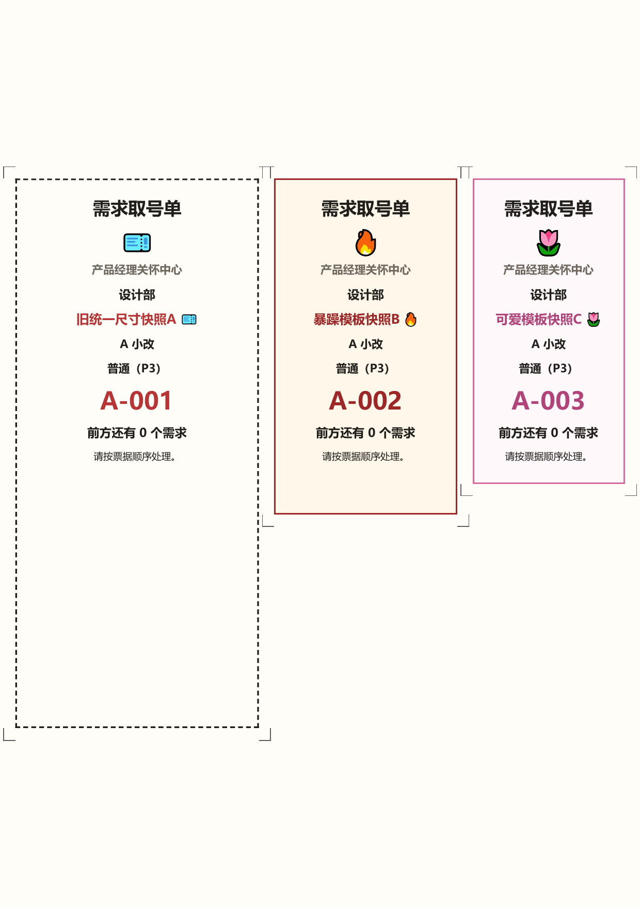

# 需求取号单生成器

一个有点好笑、但真的能用的需求排队与取号单工具。

它把零散需求维护成一条全局队列，并为每条需求生成可自定义、可重复生成、可打印的“取号单”。所有数据默认只保存在当前浏览器本地，不需要账号、服务器或数据库。

[在线体验](https://mosyoung0710-ai.github.io/requirement-ticket-generator/)

## 功能

- 全局需求队列：新增、编辑、排序、完成、暂不做与恢复。
- 多部门需求：一个需求可以关联多个部门。
- 自定义需求类型及独立编号前缀。
- P0～P3 优先级与趣味名称。
- 非必填工作量、排期日期和三种等待参考模式。
- 模块化取号单编辑器：标题、Emoji、部门、需求名称、吐槽文案等均可组合和调整。
- 三套票面模板，支持历史快照和同编号重新生成。
- 单张打印、同款多份、多个需求混合拼版。
- 同一张 A4 上可混排不同尺寸的取号单，并生成逐卡裁切标记。
- JSON 备份、兼容恢复和双确认清空。
- 核心功能完全离线，无外部接口、在线字体或 CDN。

## 使用方法

### 在线使用

打开 [GitHub Pages 在线版](https://mosyoung0710-ai.github.io/requirement-ticket-generator/)，数据会保存在当前浏览器的 `localStorage` 中。

### 本地使用

下载仓库后直接双击 `index.html` 即可。项目没有构建步骤，也不需要安装依赖。

### 打印或保存 PDF

1. 为需求确认一张取号单快照。
2. 在“打印中心”选择单张、同款多份或多需求拼版。
3. 设置尺寸、A4 页边距、卡片间距和裁切线。
4. 点击“打开浏览器打印”。
5. 打印时建议使用 100% / 实际大小；若要保留模板底色，请启用浏览器的“背景图形”。

## 数据与隐私

- 需求、配置和快照只保存在当前浏览器本地，不会上传到本仓库或任何服务器。
- 清理浏览器数据、切换浏览器或更换设备可能导致本地数据丢失，请定期导出 JSON 备份。
- 在线版和本地版之间不会自动同步数据。
- 导入备份前会校验数据；无效备份不会覆盖当前内容。

## 当前边界

- 这是一个单人、本地优先的工具，不包含账号、多人协作或云同步。
- PDF 由浏览器打印功能生成，不是服务端导出。
- 不同浏览器、操作系统和打印机驱动可能影响 Emoji 色彩及页边距，请先试打一张。
- 当前不支持拖拽自由画布、卡片旋转、自动缩放或多页智能拼版。

## 灵感来源与鸣谢

- 某天一个快秃头的弱鸡产品在逛小红书时，被一篇“需求取号单”的帖子吸引了注意力，哇，把平时去餐馆吃饭拿到的取号单和产品工作结合到一起了！帖子里的取号单也设计得幽默又可爱。
- 这个弱鸡的产品马上想到：能不能把它真的做成一个可以自己任意编辑的小工具？
- 于是马上打开了她的Codex，开始和它一起脑暴、定义需求，再交给执行会话开干。
- 经过了半个晚上+大半个白天，终于满足了我当前所有的需求。
- 她已经打印出来几张、发给公司熟悉的同事了。
- 自己真的做成了一个可爱的小项目，这种满足感让我马上想分享给大家。
- 我只是碰巧刷到了这篇帖子，还是得感谢小红书上或者是这个点子的初始构思者，谢谢谢谢！

## License

[MIT License](LICENSE)
